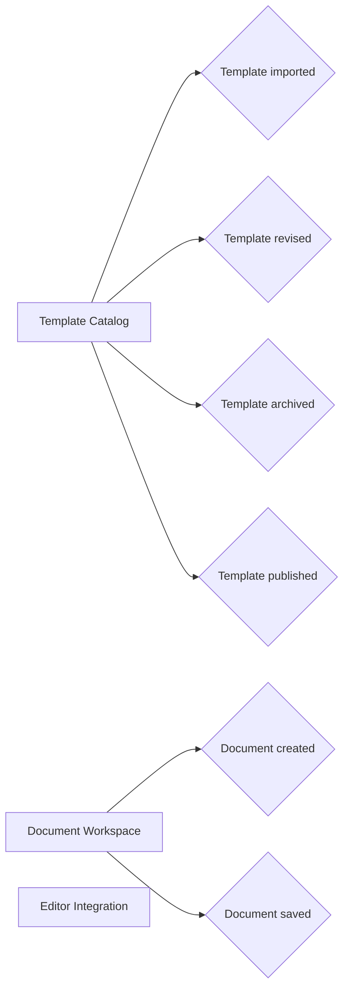

# Event Flow

```mermaid
flowchart LR
    catalog["Template Catalog"]
    event_catalog_template_imported{"Template imported"}
    catalog --> event_catalog_template_imported
    event_catalog_template_revised{"Template revised"}
    catalog --> event_catalog_template_revised
    event_catalog_template_archived{"Template archived"}
    catalog --> event_catalog_template_archived
    event_catalog_template_published{"Template published"}
    catalog --> event_catalog_template_published
    workspace["Document Workspace"]
    event_workspace_document_created{"Document created"}
    workspace --> event_workspace_document_created
    event_workspace_document_saved{"Document saved"}
    workspace --> event_workspace_document_saved
    editor_integration["Editor Integration"]
```
